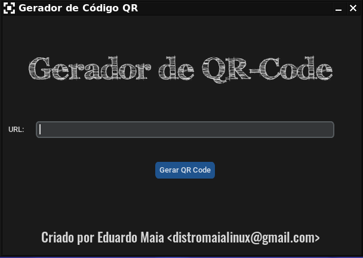

# Gerador de QRCode
Gerador de QRCode feito com Python3.11.2 e módulos tkinter, customtkinter e qrcode

  
## Imagem do programa.

 

 

### Prepare o ambiente virtual primeiro. Os comandos podem variar mas eu usei os seguinte comando no meu Gnu/Linux:

  - python3 -m venv venv ou python -m venv venv

  - source ./venv/bin/activate ou ./venv/scripts/activate

Para sair da virtualização digite:

  - deactivate
  
 

 

### Comando para atualizar o pip:

  - pip install --upgrade pip

### Por favor instale os requimentos do arquivo requirement.txt antes de executar o arquivo main.py.

  - pip install -r requirement.txt

 

 

### Mas eu instalei assim:

  - pip install qrcode pillow customtkinter
  
  - Obs: O pillow é usado para tratamento de imagens e para alguns tipos de extensões que não são habilitados no tkinter.

   
  

   
  
## Imagem QRCode abaixo aponta para meu site.

 
Meu site: https://maialinux.com

 

## Para saber mais sobre linux, python, acesse meu canal:

### https://www.youtube.com/@maialinux-oficial 

 

## Para ver modelagens 3d, construção de jogos na Godot Engine, acesse:

### https://www.youtube.com/@3dnaveia-original
